<div align="center">

  

  <br/><br/>

  <p align="center">
    <strong>A modern, node-driven cheat sheet and declarative workflow manual for Kubernetes & Minikube.</strong>
  </p>

  <p align="center">
    <a href="https://kubernetes.io/"></a>
    <a href="https://minikube.sigs.k8s.io/"></a>
    <a href="https://www.docker.com/"></a>
    
  </p>

  <p align="center">
    
  </p>

</div>

---

## 🎯 Architecture Nodes

Like visual workflow automation, Kubernetes routes traffic and computes through structured, interconnected nodes:

| Node Type | Primitive | Purpose |
|:---|:---|:---|
| **Trigger Node** | `Ingress` / `Service` | Ingests incoming network traffic and maps routes to available target endpoints. |
| **Action Node** | `Deployment` / `Pod` | Executes containers, runs processes, and controls replica states. |
| **Data Node** | `PVC` / `ConfigMap` | Injects persistent block volumes, environment variables, and operational configurations. |
| **Control Node** | `Kube-Controller` | Continuously reconciles cluster actual state against desired declarative state. |

---

## ⚡ Cluster Initiation

```bash
# 1. Start local single-node cluster with container isolation
minikube start --driver=docker --cpus=4 --memory=4096

# 2. Inspect active control plane and nodes
kubectl cluster-info
kubectl get nodes -o wide

# 3. Open integrated visual dashboard
minikube dashboard